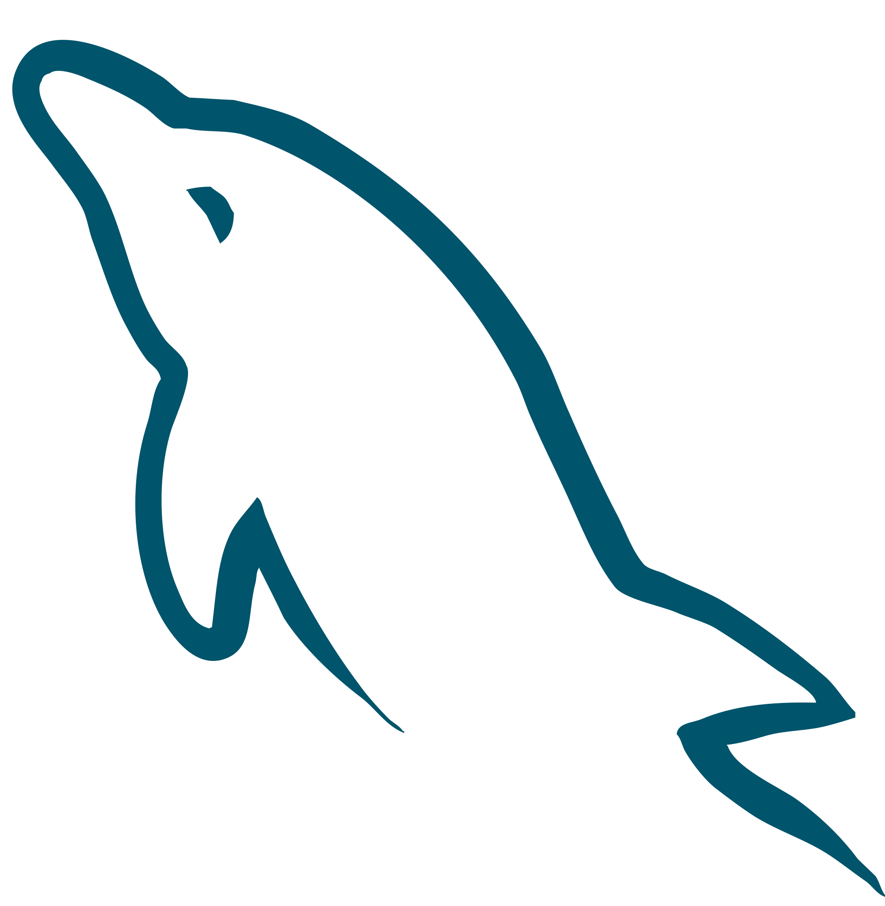
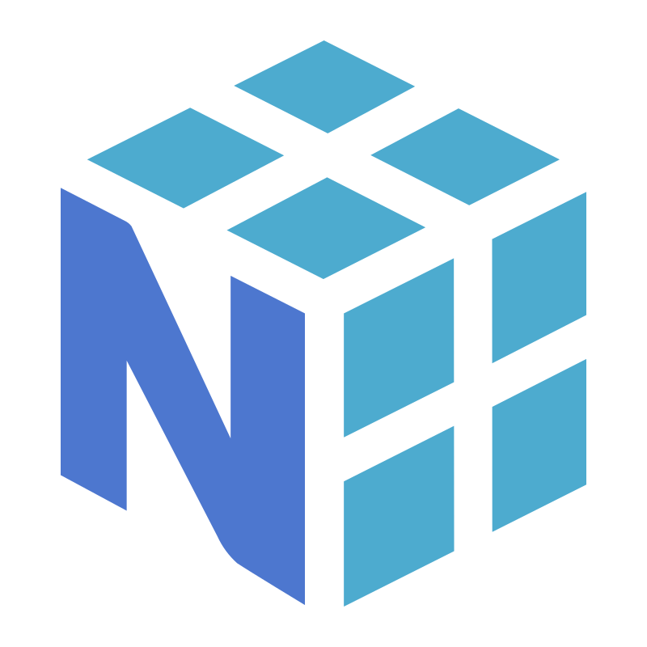
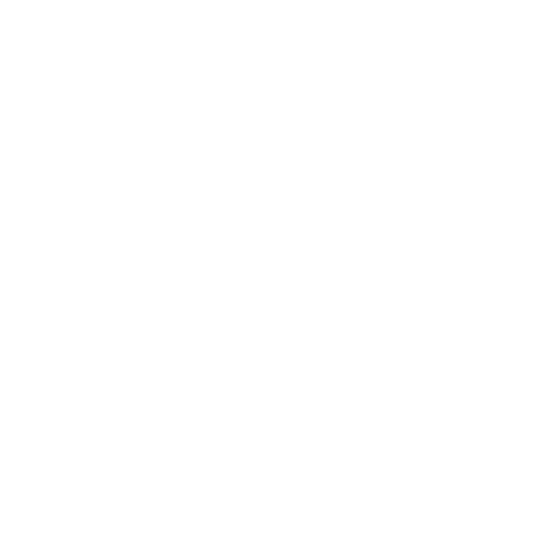

  

<strong>Darshan-A-S</strong>

  <a href="https://github.com/Darshan-A-S/Darshan-A-S"><picture><source media="(prefers-color-scheme: dark)" srcset="https://shieldcn.dev/github/stars/Darshan-A-S/Darshan-A-S.svg?variant=outline&mode=dark&font=geist" /></picture></a>
  <a href="https://github.com/Darshan-A-S/Darshan-A-S"><picture><source media="(prefers-color-scheme: dark)" srcset="https://shieldcn.dev/views/repo/Darshan-A-S/Darshan-A-S.svg?base=0&variant=outline&mode=dark&font=geist" /></picture></a>

I'm a **full-stack engineer** from Bengaluru who loves building stuff on the web, Java, Spring Boot, Python, React, and whatever else gets the job done. When I'm not coding, I'm usually editing videos or designing.

## Links

  &nbsp;&nbsp;
  &nbsp;&nbsp;
  &nbsp;&nbsp;
  &nbsp;&nbsp;
  

## 🛠️ Tech Stack

  &nbsp;
  &nbsp;
  &nbsp;
  &nbsp;
  &nbsp;
  &nbsp;
  &nbsp;
  &nbsp;
  &nbsp;
  &nbsp;
  &nbsp;
  &nbsp;
  &nbsp;
  &nbsp;
  &nbsp;
  &nbsp;
  &nbsp;
  &nbsp;
  

*My best projects are pinned below.

<!-- 

  

 -->
